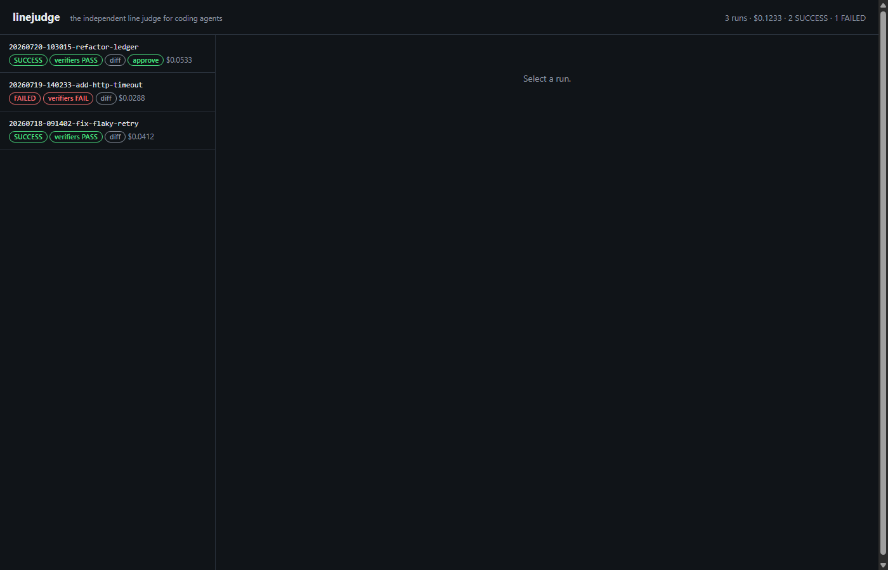
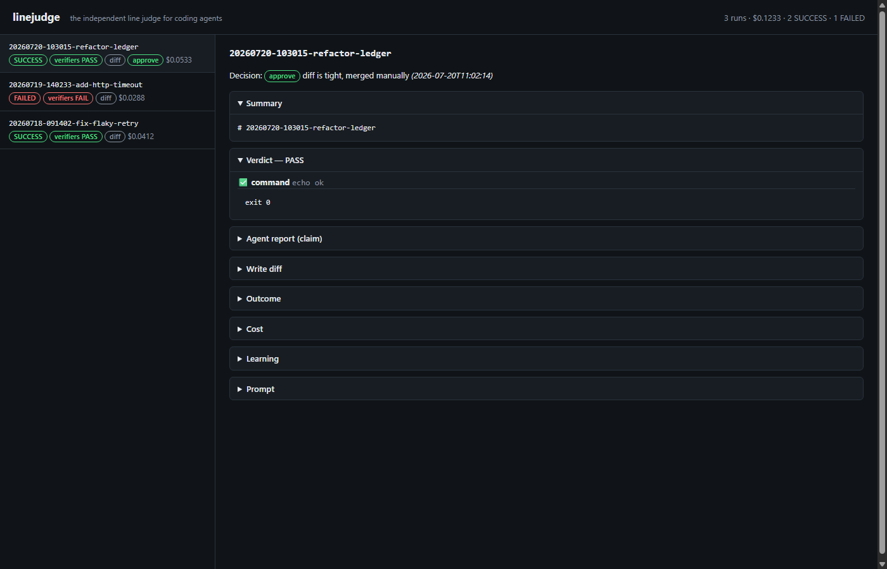

# linejudge

**The independent line judge for coding agents. Never trust the player's call.**

Coding agents routinely claim success. linejudge runs your agent on a goal, then
**independently verifies the result** — real commands, real diffs, real exit
codes — and renders its own verdict. The agent's opinion of its own work is
never consulted.

```
$ python proofs/demo.py --root demo        # 3 tasks, one agent LIES
20260721T…-issue-101-config-loader…: SUCCESS
20260721T…-issue-102-add-json-flag…: FAILED     ← claimed success, wrote nothing
20260721T…-issue-103-docs-quickstart…: SUCCESS
```

The failed run's agent reported `## Status: SUCCESS`. The `files_exist`
verifier checked the filesystem and disagreed. **The verdict, not the claim,
decides the run status.** That gap is the whole product — see a full
[sample PROOF.md](docs/PROOF-sample.md).

## Why

Every agent loop on the market grades its own homework: the model says "done"
and the harness believes it. linejudge splits the roles. The agent plays the
point; the harness calls the lines:

- **Independent verification** — a declarative verifier spec (`command`,
  `files_exist`, `diff_constraints`, `http_check`) executed by the harness,
  outside the agent session. [Full spec](docs/verifier-spec.md).
- **Blast-radius guarding** — read-only directories are snapshotted
  (`git status`) before and after every run; any unexpected mutation fails the
  run with diagnostics.
- **Verified-diff-only writes** — write access goes through a git worktree on
  an unmerged `linejudge/<run_id>` branch. The terminal state is a reviewable,
  verified diff — never a silent merge into your working tree.
- **Auditable cross-run learning** — a second, tool-less agent call distills
  each run into a versioned markdown lesson; future runs retrieve the most
  relevant lessons by tag. No opaque memory, and a poisoning guard keeps
  rate-limit garbage out of the pool.
- **Cost accounting** — per-run token/dollar cost captured from the agent's
  own telemetry into `run_cost.json` and an append-only `runs/ledger.jsonl`.
- **Local review dashboard** — every run's full evidence trail (prompt, claim,
  diff, verdict, cost, lesson) with an approve/reject gate. The decision is
  written *beside* the evidence, never into it.
- **Zero dependencies** — Python stdlib only, every source file ≤300 lines.
  You can read the whole engine in an afternoon.

Works with Claude Code headless (`claude -p`) today; the
[adapter interface](docs/adapter-guide.md) is agent-agnostic by design —
`run(prompt, cwd, timeout, …) -> RunResult` is the entire contract.

## Architecture

```
goal.md ─────► runner ─────► adapter ──────► agent (claude -p / mock / yours)
 (task +          │                             │
  verifiers)      │◄───── REPORT.md ────────────┘   ◄── the CLAIM
                  │
                  ├── guard: read_dirs snapshot before/after (trip ⇒ FAILED)
                  ├── write flow: git worktree ─► write_diff.patch ─► branch
                  ├── verifiers ─────────► verdict.json             ◄── the CALL
                  ├── distill (2nd call) ─► learnings/<id>.md
                  └── ledger ────────────► run_cost.json + runs/ledger.jsonl
                                                │
                              linejudge dashboard (review + approve/reject)
```




## Quickstart

Needs Python 3.10+. Nothing else — no API key required for the mock pipeline.

```console
git clone https://github.com/phillipmex/linejudge && cd linejudge
pip install .

# 1. See exactly what the harness would send — zero spend
linejudge run goals/examples/hello.md --dry-run

# 2. Full pipeline on a scripted mock agent (one run lies and gets caught)
python proofs/demo.py --root demo

# 3. Review the evidence
linejudge dashboard --root demo        # http://127.0.0.1:8765
```

To run against a real agent, install [Claude Code](https://docs.anthropic.com/en/docs/claude-code),
set `ANTHROPIC_API_KEY` (directly or in a gitignored `.env.local`), and drop the
`--dry-run`:

```console
linejudge run goals/examples/hello.md --root .
```

Step-by-step walkthrough with a write-mode goal: [docs/quickstart.md](docs/quickstart.md).

## Goal files

A goal is one markdown file: a fenced header (deliberately *not* YAML — no
nesting, no quoting rules, nothing to mis-parse) plus the prompt body.

```markdown
---
name: fix-config-crash
tags:
  - widget
read_dirs:
  - /path/to/reference-repo      # guarded read-only
write_repo: /path/to/widget      # optional: write cycle via worktree
verifiers:
  - command: python -m pytest -q
  - files_exist: done.txt
  - diff_constraints: max_files=5 deny=**/*.env
timeout_secs: 1800
---
Fix the config loader crash on empty YAML files. …
```

## Docs

| | |
|---|---|
| [Quickstart](docs/quickstart.md) | install → mock demo → real run → write mode |
| [Verifier spec](docs/verifier-spec.md) | built-in verifiers, semantics, authoring custom ones |
| [Adapter guide](docs/adapter-guide.md) | plug in any agent backend |
| [Comparison](docs/comparison.md) | vs bare `claude -p` loops, Aider, OpenHands, hosted agents |
| [Governance templates](docs/governance-templates.md) | constitution + definition-of-done for agent fleets |
| [ADR-0001](docs/adr/ADR-0001-lineage-and-open-core.md) | lineage and open-core rationale |
| [Sample PROOF.md](docs/PROOF-sample.md) | the claim-vs-verdict gap, rendered |

## Proof harness

`proofs/` turns real GitHub issues into goals and renders an honest scoreboard:

```console
python proofs/generate.py --repo owner/name --limit 5 --verifier "command: pytest -q"
linejudge run proofs/goals/issue-….md --root proofs/root      # per goal
python proofs/stats.py --root proofs/root                     # → PROOF.md
```

PROOF.md reports **runs succeeded** and **independently verified pass %** as
separate numbers, because they are separate facts.

## Status

v0.1.0. 96 tests, CI on Windows + Ubuntu × Python
3.10/3.12, zero runtime dependencies.

## License

Apache-2.0
